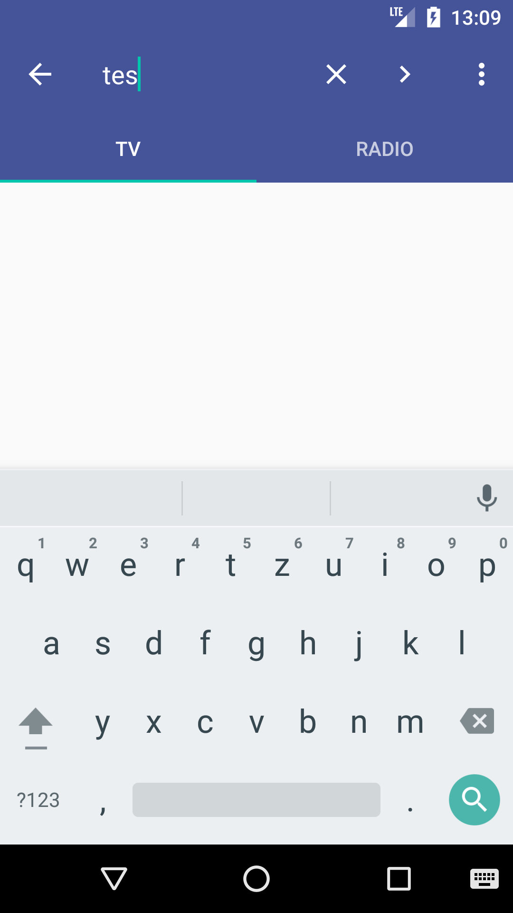

## About
This is an example of an m3u streaming player for android. The app uses a tab layout to seperate between radio and tv channels. For each streaming set, there is one .m3u8 file containing the name of the channel and the URI for playback. It uses the [tiny-m3u parser](https://github.com/lucasepe/tiny-m3u-parser) to parse those files. Every channel will be placed into a grid view of the corresponding tab and can be filtered by the [Material Search View](https://github.com/MiguelCatalan/MaterialSearchView). If the user selects a channel, either the [Google Exoplayer](https://github.com/google/ExoPlayer) VideoActivity or the Music Background Service starts. This Streaming Player supports buffering, fullscreen video-playback and interacts with the AudioManager to pause/resume playback on different events. Each gridview element contains the name and the logo of a channel. Please place all available logos in the *assets/logo* folder, if no logo is available, the *no_logo.png* will be shown. Note, that you have to modify the content of the streaming files.

On first usage, the SettingsActivity will be loaded. This Activity is empty right now, but may be your entry pont to check and store credentials inside SharedPreferences, e. g. when you use placeholders like *{user}* or *{password}* insinde your streaming file.

## How to use own copy
1. Create a fork of this project
2. Open Android Studio --> Check out Project from version control --> Github

## Add streaming content
As already mentioned, you need to modify the .m3u8 files placed in *assets/streaming* to add content for your streaming app.

## Add logos
The logos placed inside the *assets/logos* folder must be the channel name in lower case as an png file, e. g. "Test Channel" will be "test channel.png". You may want to check [this](https://github.com/3PO/Senderlogos) out to get a collection of channel logos.

## Minimal requirement of the App
Use at least the API Level 19 (Android 4.4) and Android Studio for Developing your own Streaming App. Have fun! :)

## Preview

